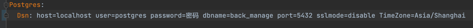
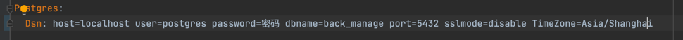

# back_manage
GO搭建的后台管理

使用的技术： GO-ZERO、GORM

数据库：PostgreSQL

项目拉取后需要修改配置文件中数据库的链接（注：当前项目中所有数据库链接都是本地链接，
如需链接服务器数据库请自行修改调整，非PostgreSQL数据库链接请自行摸索或者
参照GO-ZERO官方文档修改）

back_manage/data/init_data.go 文件
密码处填写自己对应PostgreSQL数据库的密码

修改方式同上(注：service服务中都存在下述配置文件)

back_manage/service/sys/cmd/api/etc/sys-api.yaml 文件

